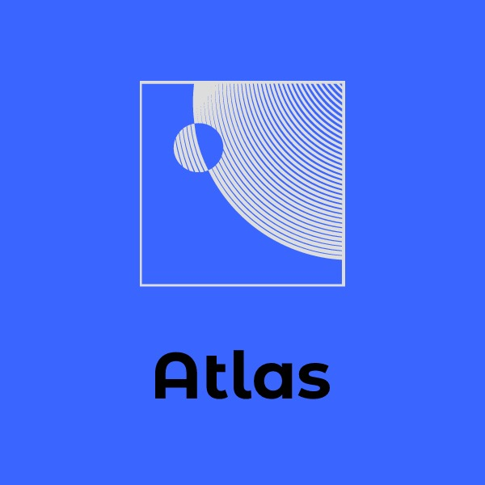

# 🚀 Atlas
```
       _______ _                _____ 
    /\|__   __| |        /\    / ____|
   /  \  | |  | |       /  \  | (___  
  / /\ \ | |  | |      / /\ \  \___ \ 
 / ____ \| |  | |____ / ____ \ ____) |
/_/    \_\_|  |______/_/    \_\_____/ 

🚀 This is Atlas. Fast. Fuel efficient. The official rocket of Firebolt Space Agency.
We chose to build Atlas not because it is easy, but because it is hard.

- Aaron Ma & Rohan Fernandes
```

@NOTE: Both SVG's are copied from each other and renamed: (basically): it was duplicated and then renamed as a new svg 





## Alert! Please Read!
We, Aaron Ma and Rohan Fernandes are preparing a special holiday release for April Fool's Day 2020. Stay tuned for updates!

FOR ROHAN & AARON:

Please check your assignments and grades in ASSIGNMENTS.md

## Atomic Base Info
**Alert!** Atomic Base is still *unstable*. If Atomic Base crashes, please do not be alarmed. Note that Atomic Base is a side project to simplify Travis CI and building for Atlas and is *not to be used for anything else*.

## Atlas Info
@TODO(aaronhma) : Update

**Rohan; Atlas Info**
```
Atlas is a SpaceShip that travels to the moon. We built it becasue we wanted to help the space industry with its rocket missioin.

Now, I made the HoneyComb and SkyHawk Part. HoneyComb is a Website created

to control parts of the SpaceShip as well as provide entertainment.

SkyHawk is a time management app built using Microsoft Xamarin it uses C# to do the CodeBehind and XAML to show the User Interace.

SkyHawk was built because onboard atlas people don't

have very good time agament as there is not sense of time on the ship.  SkyHawk combines Python, and C# 

to create wonderfule and amazing games and it is built with Java and Swift 

Now Project Omega is about helping with Coronavirus which put the whole earth in a lockdown. As there were not many Tests and people needed help.

Omega helps with Coronavirus Concerns using Python and Machine

Learning as well as C# This application will create a less concern

The Rocket is made by Aaron Ma. He used C++ and Python for Rocket Functionality
```

 Loading...

## Getting Started Guide
Welcome to the wonderful world of Atlas! Atlas is full of easy-to-use features, but you must calibrate Atlas correctly before you take it out for a spin.

🎖 Experimental. It really won't work...

1. Get Atlas.
```bash
# This will not work on most Windows or Linux:
git clone git+https://bitbucket.org/aaronhma/atlas
```

2. Install and build Atlas.

3. Start Atlas server.

4. Start Honeycomb by following the Honeycomb Quickstart Guide below, written by the Honeycomb maintainer.

## Honeycomb Quickstart Guide(written by Rohan):
**The Docs: For Testing**

To start: Go to the HoneyComb Folder 
```
Execute Command: python server.py 
```
This starts the Server

In your terminal you will see a url

By default, you will go to `localhost:7777`, unless you changed the port number or the port number is already in use.

**ERROR HANDLING WITH HOSTS**

If it goes to another website, go to HoneyComb's server.py and in app.run change the Port to another number 

To change in do this: `Port = {number}`: where nuumber is the port number you want and then, you can go to `localhost:{number}`

**Short Cut for LocalHost**

What you can do is copy the link or **Windows**: Alt + Click **Mac** Control + Click **Linux**:

@TODO: Aaron on your linux go to honeycomb and run python server.py then u will see a link to go to. hover over and it will show u the command

@TODO: Rohan make docs for OnBoard, Aaron supply OS for machine running the code

**Website**


**TADA** You will see the website.

[If you still get errors contact the honeycomb writer](mailto:rohanf6219@gmail.com)

@TODO(aaronhma): figure out a way to access firebolt internal with a login

 Loading...

## Examples
@TODO(rohan): write docs

@TODO(aaronhma): create atlas examples

## Atlas Status
| Component    | Status                                    | Submitted By    |  Remarks    |
| ------------ |   -------------                           | -----           | ----        |
| Stage 1  🎖  |  | aaronhma        | Passed.     |
| Stage 2  🎖  |  | aaronhma        | Failed.     |
| Stage 3  🎖  |  | aaronhma        | Failed.     |
| Honeycomb    |  | rohan           | Passed.     |
| SkyHawk      |  | aaronhma, rohan | Failed.     |
| Skyforce     |  | aaronhma, rohan | Building... |
| PTurtle      |  | rohan           | Passed.     |
| Omega        |  | aaronhma, rohan | Building... |

[Information not correct? Contact maintainer to correct](mailto:hi@aaronhma.com)

**Combined with mini-projects: Skyforce, PTurtle and more!**